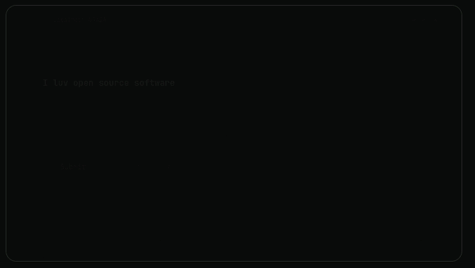

# annotakit

[](https://www.npmjs.com/package/annotakit)
[](https://www.npmjs.com/package/annotakit)
[](LICENSE)

Click your UI, leave notes, generate agent-ready context.

Annotakit adds a floating toolbar to your SvelteKit app. Click elements, select text, or drag to multi-select, then export structured markdown that AI agents can consume directly.



## Quick Start

```bash
pnpm add annotakit
```

```svelte
<!-- src/routes/+layout.svelte -->
<script>
  import { Annotakit } from 'annotakit';
  import 'annotakit/styles';
</script>

<Annotakit />
<slot />
```

A floating toolbar appears in the corner. Click any element to annotate it.

Start collapsed with `<Annotakit minimized />`.

See the full [package README](packages/core/README.md) for props, output formats, and configuration.

## How It Works

1. **Annotate** - click elements, select text, or drag to multi-select
2. **Comment** - add notes describing the change needed
3. **Export** - copy structured markdown to your clipboard or pipe it to an AI agent

Output includes CSS selectors, Svelte component info, accessibility attributes, and computed styles. Everything an agent needs to locate and understand the element.

## Packages

| Package | Description |
| --- | --- |
| [`annotakit`](packages/core) | Core library - Svelte 5 component + framework-agnostic engine |
| `@annotakit/mcp` | MCP server (planned) |

## Development

Requires [pnpm](https://pnpm.io/) and Node.js 18+.

```bash
# Install dependencies
pnpm install

# Start dev playground
pnpm dev

# Type check
pnpm check

# Build package
pnpm build
```

## Acknowledgements

Inspired by [Agentation](https://github.com/benjitaylor/agentation) (PolyForm Shield 1.0.0). Annotakit is a clean-room implementation built for the SvelteKit ecosystem, written from scratch under the MIT license.

## License

© 2026 nodestarQ

[MIT](LICENSE)
